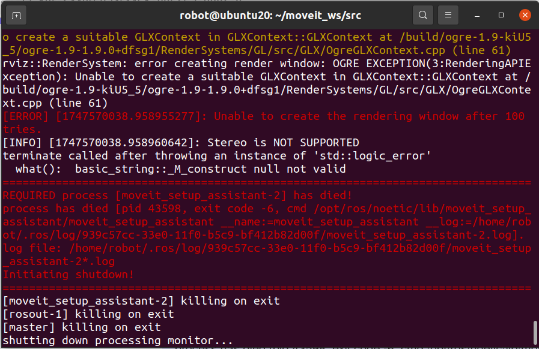

# 本仓库仅供课程学习使用
# 机器人学导论实验
参考内容：
- 张涛：https://github.com/Suixin04/ws_moveit.git
- 张禹豪：https://github.com/Ruochen0513/forABB_IRB_1410
## 准备工作
### 系统准备：ubuntu20.04 + ros1 noetic
- ubuntu20.04：略
- ros1 noetic（鱼香一键安装）：```wget http://fishros.com/install -O fishros && . fishros```
- 安装依赖：```sudo apt install python3-rosdep python3-rosinstall python3-rosinstall-generator python3-wstool build-essential```
- rosdep：
  ```sudo apt install python3-rosdep```
  ```sudo rosdep init```
  ```rosdep update```
### 安装movelt并创建工作空间
- 更新：
  ```sudo apt update```
  ```sudo apt dist-upgrade```
- 安装构建工具：
  ```sudo apt install ros-noetic-catkin python3-catkin-tools```
  ```sudo apt install python3-wstool```
- 安装movelt及其组件：
  ```sudo apt install ros-noetic-moveit```
  ```sudo apt install ros-noetic-moveit-ros-visualization ros-noetic-moveit-planners ros-noetic-moveit-ros-move-group ros-noetic-moveit-ros-perception```
- 创建工作空间moveit_ws并添加环境变量：
  ```mkdir -p ~/moveit_ws/src```
  ```cd ~/moveit_ws/src```
  ```catkin_init_workspace```
  ```cd ~/moveit_ws```
  ```catkin_make```
  ```echo "source ~/moveit_ws/devel/setup.bash" >> ~/.bashrc```
  ```source ~/.bashrc```
### 安装机器臂（iiwa7）包 
- 下载urdf文件：
  ```cd ~/moveit_ws/src```
  ```git clone https://github.com/facebookresearch/differentiable-robot-model.git```
  ```sudo apt install ros-noetic-franka-description```
- 配置differentiable-robot-model为ros包：添加package.xml和CMakeLists.txt，详细代码略。
- 导出机械臂包：```roslaunch moveit_setup_assistant setup_assistant.launch```
  导出时出现以下错误：OGRE图形渲染引擎和ROS MoveIt Setup Assistant启动失败
  
  - 安装mesa工具```sudo ubuntu-drivers autoinstall```
  - 修改urdf文件（位于/home/robot/moveit_ws/src/differentiable-robot-model/diff_robot_data/kuka_iiwa/urdf/iiwa7.urdf）：为<mesh filename="meshes/iiwa7/x/x"/>在meshes前添加"package://differentiable-robot-model/diff_robot_data/kuka_iiwa/"
- MoveIt Setup Assistant：
  - 自碰撞矩阵：Self-Collisions -> Generate Collision Matrix
  - 虚拟基座关节：Virtual Joints -> Add Virtual Joint -> Virtual Joint Name:virtual_joint -> Parent Frame Name:world
  - 规划组：Planning Groups -> Add Group -> (放大页面到完全显示) -> Group Name:manipulator -> Kinematic Solver:kdl_kinematics_plugin/KDLKinematicsPlugin -> Add Joints:iiwa_joint_1---iiwa_joint_7,左端>右端
  - 原姿态：Robot Poses -> Add Pose -> Pose Name:home -> Planning Group:manipulator -> 默认初始零值
  - 末端执行器：End Effectors -> Add End Effector -> End Effector Name:end_effector -> End Effector Group:manipulator -> Parent Link:iiwa_link_7
  - 作者信息填写：Author Information -> 略
  - 生成配置文件：Configuration Files -> 路径/名称 -> Generate Package
- 编译测试：
  ```cd ~/moveit_ws```
  ```catkin_make```
  ```roslaunch iiwa7_moveit_config demo.launch```
## iiwa7
### RViz控制
- 创建控制包
  ```cd ~/moveit_ws/src```
  ```catkin_create_pkg iiwa7_control moveit_ros_planning_interface roscpp rospy std_msgs geometry_msgs```
  ```cd iiwa7_control```
  ```mkdir -p scripts```
- 点位控制：五角星+避障
  - 代码：
    - ```touch scripts/point_control.py```、
    - ```chmod +x scripts/point_control.py```
    - 代码解析见源码。
  - 运行：
    - ```roslaunch iiwa7_moveit_config demo.launch```
    - ```rosrun iiwa7_control point_control.py```
    - 可视化轨迹：左上display -> 最下Planned Path -> Show Trail
                左中Add -> Maker -> OK -> 左中Maker -> Maker Topic下拉选取话题
- 轨迹控制：字符（字母/数字）
  - 代码：
    - ```touch scripts/trajectory_control.py```
    - ```chmod +x scripts/trajectory_control.py```
    - 代码解析见源码。
  - 运行：
    - ```roslaunch iiwa7_moveit_config demo.launch```
    - ```rosrun iiwa7_control trajectory_control.py```